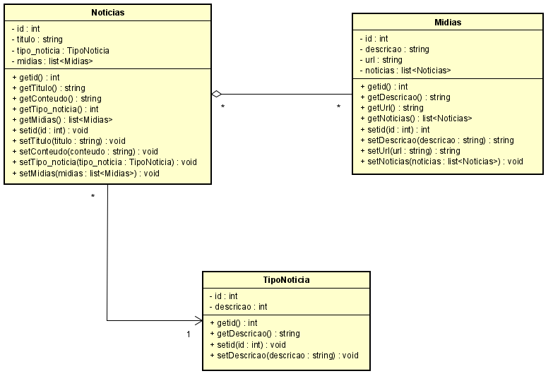

# ProjetoLPOOE2_BarbaraWehrmann

Avaliação da matéria Linguagem de Programação Orientada a Objetos

## Modelagem Realizada
A modelagem do sistema incluiu as seguintes entidades e seus relacionamentos:

